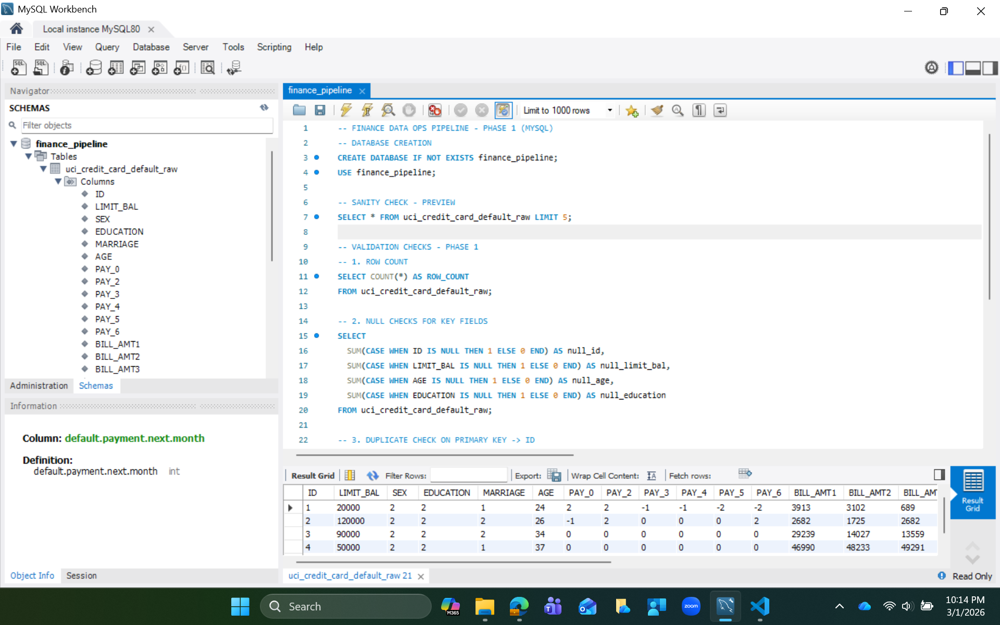
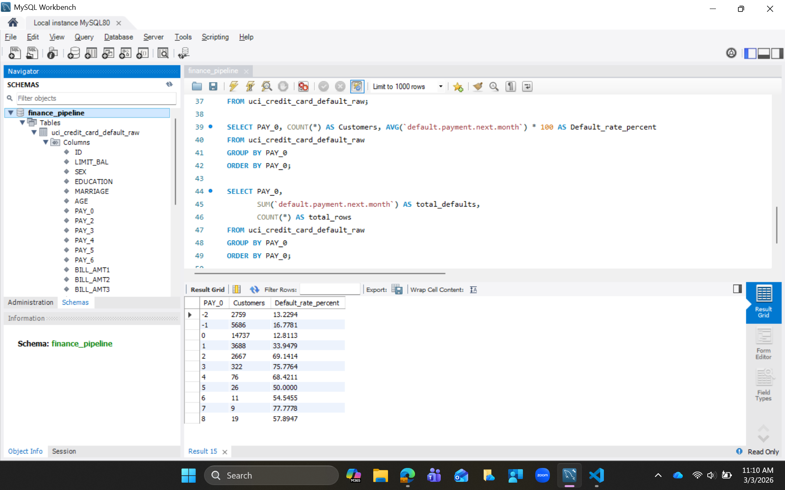

# Finance Data Ops Pipeline

A Data Operations–oriented pipeline simulating real-world financial data ingestion, validation, and analytics workflows using SQL, with upcoming Python and AWS integration.

---

## Project Overview

This project simulates a real-world Data Operations workflow where a financial institution:

- Receives raw client credit data (CSV format)
- Loads it into a relational database (MySQL)
- Performs data quality validations
- Extracts analytical insights using SQL
- Prepares the system for automation and AWS deployment

The objective is to demonstrate practical Data Engineering and Data Operations skills aligned with modern analytics workflows.

---

## Dataset

**Dataset Used:** UCI Credit Card Default Dataset  
**Source:** https://archive.ics.uci.edu/ml/datasets/default+of+credit+card+clients  

The dataset contains:
- 30,000 customer records
- 24 attributes
- Financial, demographic, and repayment history information
- Target variable indicating default behavior

---

## Tech Stack (Phase 1)

- MySQL Workbench
- SQL
- Git & GitHub
- VS Code

Upcoming:
- Python (Pandas ETL)
- AWS S3
- AWS Athena

---

# Phase 1 – SQL Ingestion & Sanity Checks

### 1. Database Setup
- Created database: `finance_pipeline`
- Imported CSV into table: `uci_credit_card_default_raw`


---

### 2. Data Sanity Checks Performed



#### Row Count Validation

```sql
SELECT COUNT(*) AS row_count
FROM uci_credit_card_default_raw;
```
`Result: Count = 30,000`
#### Null Value Checks (Key Fields)
```sql
SELECT
  SUM(CASE WHEN ID IS NULL THEN 1 ELSE 0 END) AS null_id,
  SUM(CASE WHEN LIMIT_BAL IS NULL THEN 1 ELSE 0 END) AS null_limit_bal,
  SUM(CASE WHEN AGE IS NULL THEN 1 ELSE 0 END) AS null_age
FROM uci_credit_card_default_raw;
```
`Result: No NULL values detected in critical fields`

#### Duplicate ID Detection
```sql
SELECT ID, COUNT(*) AS cnt
FROM uci_credit_card_default_raw
GROUP BY ID
HAVING cnt > 1;
```
`Result: No Duplicate IDs found`

#### Default Rate Calculation
```sql
SELECT
  AVG(`default.payment.next.month`) * 100 AS default_rate_percent
FROM uci_credit_card_default_raw;
```
`Result: Default Rate ~ 22%`

---

### 3. Basic Profiling and Default Segmentation Queries

#### Repayment Behavior vs Default Risk (PAY_0 Analysis)

```sql
SELECT
  PAY_0,
  COUNT(*) AS customers,
  ROUND(AVG(`default.payment.next.month`) * 100, 2) AS default_rate_percent
FROM uci_credit_card_default_raw
GROUP BY PAY_0
ORDER BY PAY_0;
```
#### What This Query Does?
1. Groups customers based on their most recent repayment status (PAY_0)
2. Counts how many customers fall into each repayment category
3. Calculates the default rate percentage within each group
4. Helps measure how repayment delays correlate with default risk




#### Interpretation of Results

1. Customers with PAY_0 = -2 or -1 (paid on time / early) show very low default rates
2. Customers with PAY_0 = 0 (no delay) have moderate default risk
3. Customers with PAY_0 = 1, 2, 3+ show progressively higher default percentages
4. Severe repayment delays correspond to significantly increased default probability

This confirms that recent repayment behavior is a strong predictor of default risk

#### Key Insight

1. The analysis demonstrates a clear relationship between repayment delay and credit default risk.
2. As repayment delay increases, the percentage of customers defaulting in the following month increases substantially.
3. This validates repayment history as a critical feature for credit risk modeling and financial decision-making.