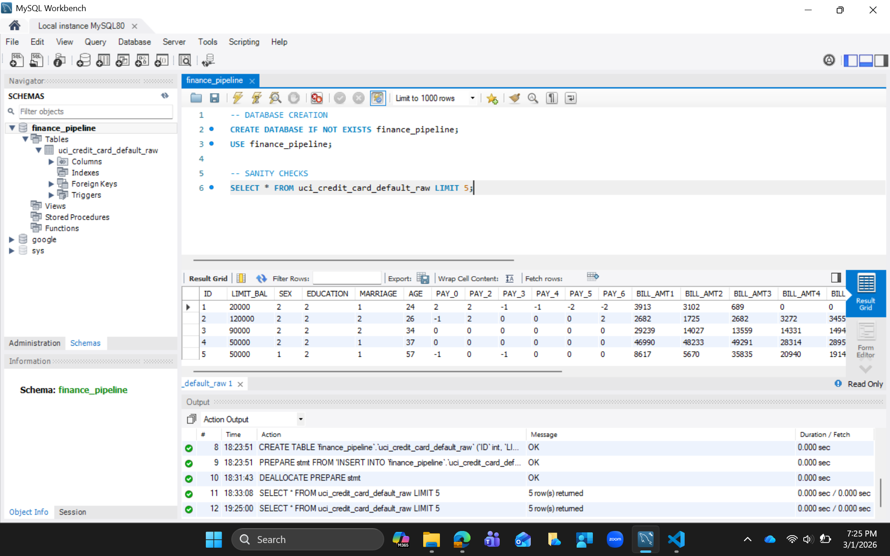
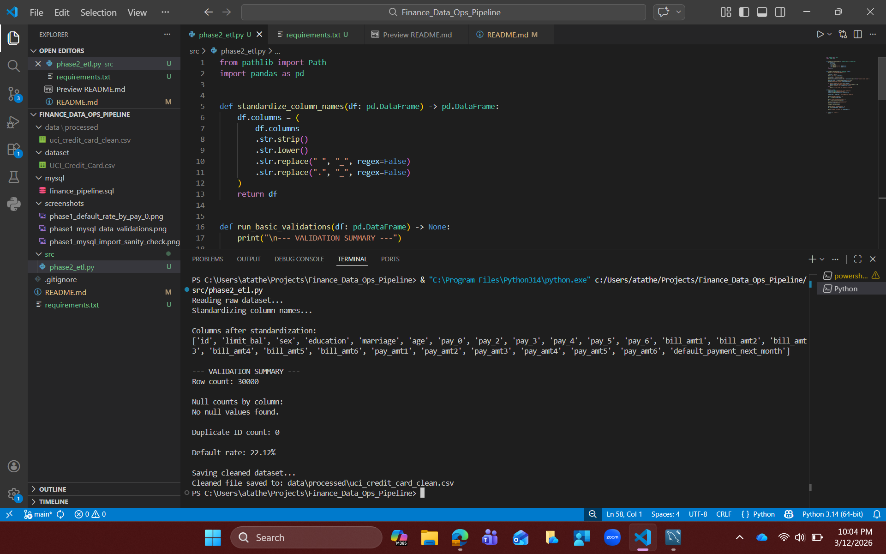
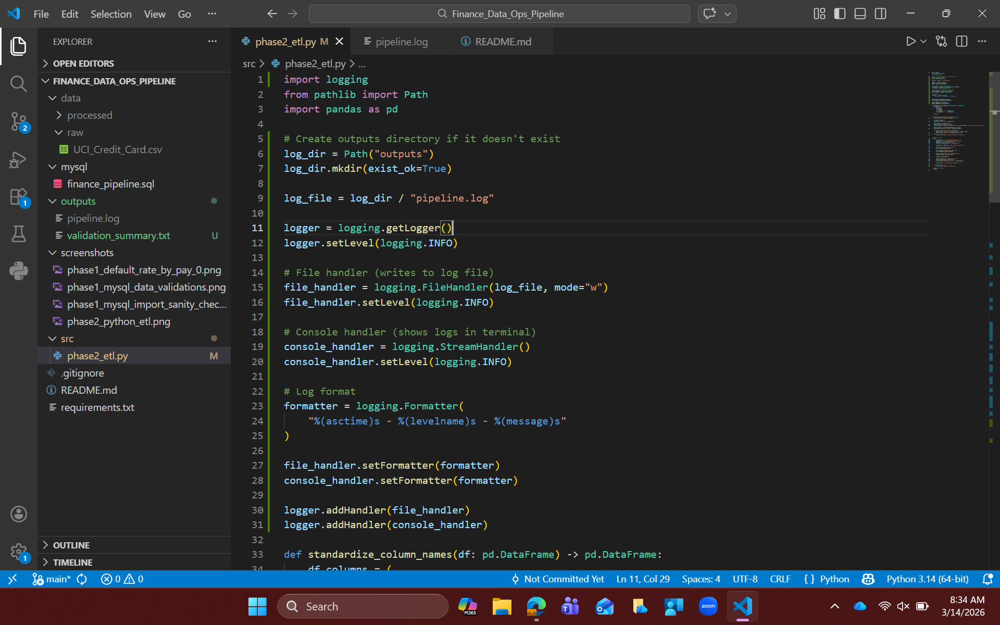
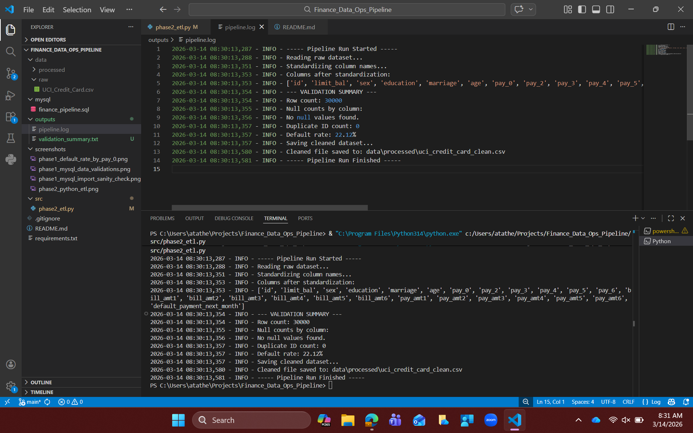
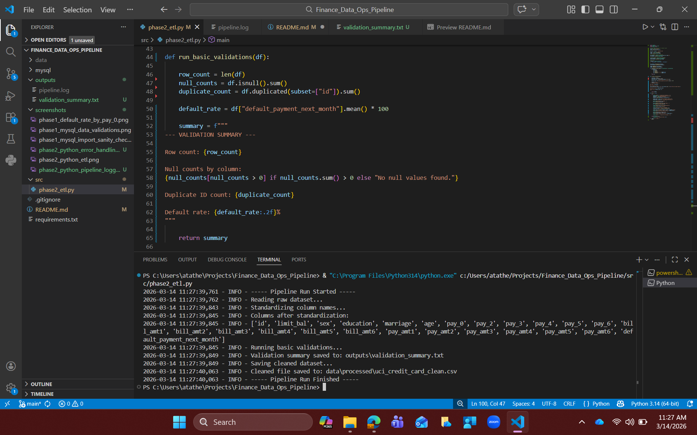
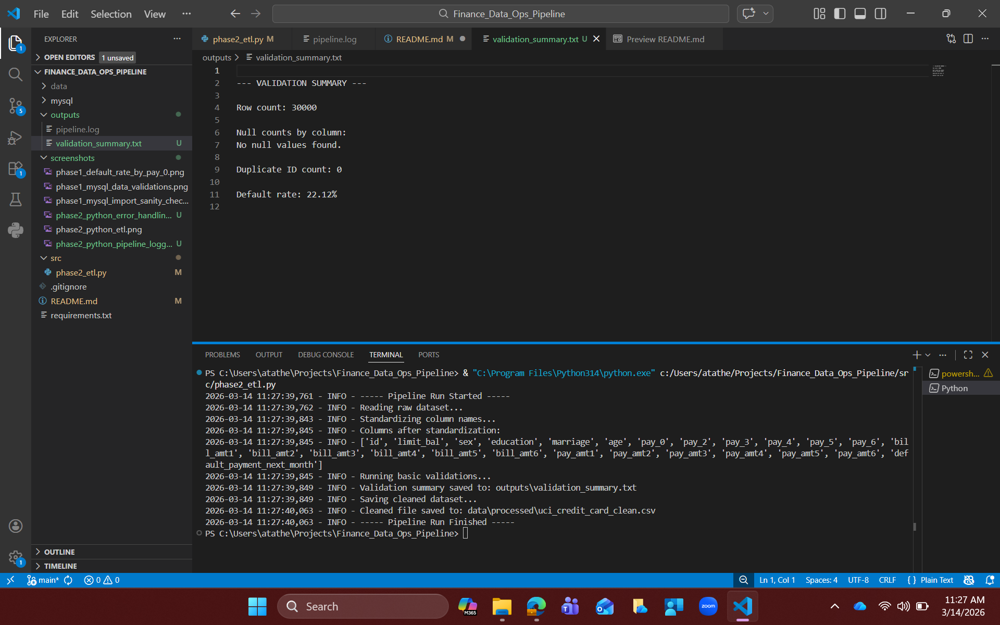
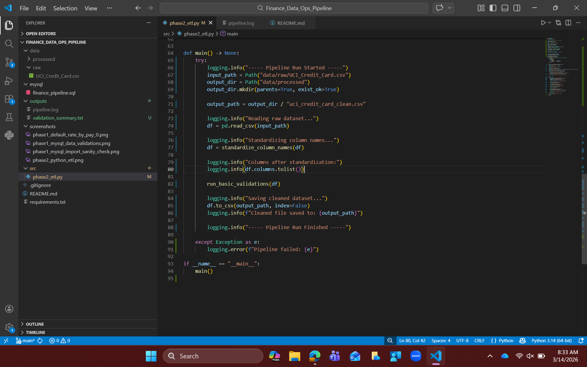

# Finance Data Ops Pipeline

A Data Operations–oriented pipeline simulating real-world financial data ingestion, validation, and analytics workflows using SQL, with upcoming Python and AWS integration.

---

## Project Overview

This project simulates a real-world Data Operations workflow where a financial institution:

- Receives raw client credit data (CSV format)
- Loads it into a relational database (MySQL)
- Performs data quality validations
- Extracts analytical insights using SQL
- Prepares the system for automation and AWS deployment

The objective is to demonstrate practical Data Engineering and Data Operations skills aligned with modern analytics workflows.

---

## Dataset

**Dataset Used:** UCI Credit Card Default Dataset  
**Source:** https://archive.ics.uci.edu/ml/datasets/default+of+credit+card+clients  

The dataset contains:
- 30,000 customer records
- 24 attributes
- Financial, demographic, and repayment history information
- Target variable indicating default behavior

---

## Tech Stack (Phase 1)

- MySQL Workbench
- SQL
- Git & GitHub
- VS Code

Upcoming:
- Python (Pandas ETL)
- AWS S3
- AWS Athena

---

# Phase 1 – SQL Ingestion & Sanity Checks

### 1. Database Setup
- Created database: `finance_pipeline`
- Imported CSV into table: `uci_credit_card_default_raw`


<p align="center">
  
  <br><br>
  Figure 1: MYSQL Workbench - Data Ingestion
</p>


---

### 2. Data Sanity Checks Performed

<p align="center">
  
  <br><br>
  Figure 2: Data Sanity Checks
</p>

#### Row Count Validation

```sql
SELECT COUNT(*) AS row_count
FROM uci_credit_card_default_raw;
```
`Result: Count = 30,000`
#### Null Value Checks (Key Fields)
```sql
SELECT
  SUM(CASE WHEN ID IS NULL THEN 1 ELSE 0 END) AS null_id,
  SUM(CASE WHEN LIMIT_BAL IS NULL THEN 1 ELSE 0 END) AS null_limit_bal,
  SUM(CASE WHEN AGE IS NULL THEN 1 ELSE 0 END) AS null_age
FROM uci_credit_card_default_raw;
```
`Result: No NULL values detected in critical fields`

#### Duplicate ID Detection
```sql
SELECT ID, COUNT(*) AS cnt
FROM uci_credit_card_default_raw
GROUP BY ID
HAVING cnt > 1;
```
`Result: No Duplicate IDs found`

#### Default Rate Calculation
```sql
SELECT
  AVG(`default.payment.next.month`) * 100 AS default_rate_percent
FROM uci_credit_card_default_raw;
```
`Result: Default Rate ~ 22%`

---

### 3. Basic Profiling and Default Segmentation Queries

#### Repayment Behavior vs Default Risk (PAY_0 Analysis)

```sql
SELECT
  PAY_0,
  COUNT(*) AS customers,
  ROUND(AVG(`default.payment.next.month`) * 100, 2) AS default_rate_percent
FROM uci_credit_card_default_raw
GROUP BY PAY_0
ORDER BY PAY_0;
```
#### What This Query Does?
1. Groups customers based on their most recent repayment status (PAY_0)
2. Counts how many customers fall into each repayment category
3. Calculates the default rate percentage within each group
4. Helps measure how repayment delays correlate with default risk


<p align="center">
  
  <br><br>
  Figure 3: Basic Profiling Queries
</p>

#### Interpretation of Results

1. Customers with PAY_0 = -2 or -1 (paid on time / early) show very low default rates
2. Customers with PAY_0 = 0 (no delay) have moderate default risk
3. Customers with PAY_0 = 1, 2, 3+ show progressively higher default percentages
4. Severe repayment delays correspond to significantly increased default probability

This confirms that recent repayment behavior is a strong predictor of default risk

#### Key Insight

1. The analysis demonstrates a clear relationship between repayment delay and credit default risk.
2. As repayment delay increases, the percentage of customers defaulting in the following month increases substantially.
3. This validates repayment history as a critical feature for credit risk modeling and financial decision-making.

---

# Phase 2 – Python ETL and Validation Automation

In this phase, the manual SQL-based validation workflow from Phase 1 was automated using Python and pandas.
The goal was to convert the manual validation process into a repeatable ETL pipeline that can automatically process raw datasets.

The pipeline performs the following steps:

1. Reads the raw dataset from a CSV file.
2. Standardizes column names.
3. Performs automated data validation checks.
4. Generates a validation summary report.
5. Saves the cleaned dataset for downstream processing.
6. Logs pipeline execution steps.
7. Handles errors gracefully using exception handling.

This phase demonstrates how Python can be used to build automated data pipelines for data operations workflows.

<p align="center">
  
  <br><br>
  Figure 4: Python ETL Pipeline
</p>

## ETL Pipeline
ETL stands for Extract, Transform, Load, a common data engineering workflow.

1. Extract - Extracting means reading data from a source system.

In this project, the dataset is extracted from a CSV file using pandas.

2. Transform - Transformation refers to cleaning, validating, or modifying data so it becomes usable.

Transformations performed in this phase include:
1. Standardizing column names
2. Checking for missing values
3. Detecting duplicate records
4. Validating dataset size
5. Calculating default rate

These transformations help ensure data integrity and reliability before further analysis.

3. Load - Loading means storing the processed dataset into a destination system.

In this phase, the cleaned dataset is exported to:
`data/processed/uci_credit_card_clean.csv`
This cleaned dataset will later be used for analytics and cloud processing.

## Python Libraries 
1. pandas - pandas is a Python library used for data manipulation and analysis. It provides powerful data structures such as DataFrames, which allow structured data to be processed efficiently.

Examples of pandas operations used:

1. Reading CSV files
2. Handling missing values
3. Detecting duplicate records
4. Calculating summary statistics

## Automated Data Validation
The pipeline automatically performs several data quality checks.
### 1. Row Count Validation
Ensures that the dataset contains the expected number of rows.
```python
len(df) 
```
`Result: Row Count: 30,000`

### 2. Null Value Detection
Checks whether any column contains missing values.
```python
df.isnull().sum()
```
`Result: No null values found`

### 3. Duplicate Record Detection
Checks whether multiple rows contain the same customer ID.
```python
df.duplicated(subset=["id"]).sum()
```
`Result: Duplicate ID count: 0`

### 4. Default Rate Calculation
The dataset contains a binary target variable. The average of this column represents the default rate.
```python
df["default_payment_next_month"].mean() * 100
```
`Result: Default rate: 22.12%`

## Pipeline Logging
The pipeline uses Python's logging module to record execution events.
<p align="center">

<br><br>
Figure 5: Pipeline Logging Input
</p>

Logging is used to track:

1. pipeline start
2. dataset ingestion
3. validation steps
4. dataset export
5. pipeline completion
6. error events

<p align="center">

<br><br>
Figure 6: Pipeline Logging Output
</p>

Logs are written to:
`outputs/pipeline.log`

Logging helps track system activity and makes debugging easier.

## File Handling
File handling is the process of creating, reading, writing, or modifying files using a programming language.

It allows programs to store data permanently outside the program.

Instead of keeping data only in memory, the program can save results into files.
The pipeline generates structured outputs automatically.

<p align="center">

<br><br>
Figure 7: String Formatting (Preparing Output)
</p>


Generated files include:

<p align="center">

<br><br>
Figure 8: Validation report generated using Python file handling.
</p>

Validation Summary
`outputs/validation_summary.txt`

This file contains a human-readable summary of dataset validation results.

## Error Handling
Error handling is implemented using Python’s exception handling mechanism (try–except) to prevent the pipeline from crashing and to log errors when they occur.

1. Exception handling is the programming mechanism used to catch and manage runtime errors (exceptions).
2. In Python, errors that occur during execution are called exceptions.
3. The pipeline includes exception handling using try–except blocks.

Error handling ensures that if the pipeline fails, the error is captured and written to the log file instead of crashing silently.

<p align="center">

<br><br>
Figure 9: Error handling using Python's exception handling mechaninsm
</p>

```python
try:
    run_pipeline()
except Exception as e:
    logging.error(f"Pipeline failed: {e}")
```
Benefits:
1. prevents unexpected crashes
2. provides clear error messages
3. improves reliability of automated pipelines


